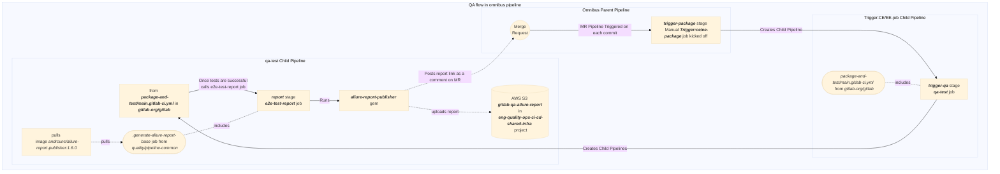

# Test Report Generation in Omnibus-GitLab

[[_TOC_]]

The following three pipelines are created while generating the allure-report

- Omnibus pipeline
- TRIGGERED_CE/EE_PIPELINE child pipeline (Manually Triggered)
- QA-TEST child pipeline

## Omnibus MR Pipeline

An Omnibus-GitLab project MR pipeline can be triggered in two ways

- manually running the pipeline
- a MR exists and a commit is pushed to the repository

The tests in the pipeline are currently triggered manually by

- `Trigger:ce-package` job
- `Trigger:ee-package` job

### Trigger:ce/ee-package job

These jobs can be triggered manually once the `generate-facts` job is completed. On triggering these jobs, a child pipeline is created.

The child pipeline, called `TRIGGERED_CE/EE_PIPELINE` is generated in the Omnibus-GitLab repository

## TRIGGERED_CE/EE_PIPELINE child pipeline

This child pipeline consists of a job called `qa-test` which uses the `package-and-test/main.gitlab-ci.yml` file of the main GitLab project.

### qa-test job

The `qa-test` job triggers another child pipeline in the Omnibus-GitLab repository
To get an allure report snapshot as a comment in the MR, following environment variables need to be passed to `qa-job`

| Environment Variable              | Description |
| ----------------------------------|-------------|
|   `GITLAB_AUTH_TOKEN`             | This is used to give access to the Danger bot to post comment in `omnibus-gitlab` repository. We are using  `$DANGER_GITLAB_API_TOKEN` which is also being used for other Danger bot related access in `omnibugs-gitlab` as mentioned [ci-variable](https://gitlab.com/gitlab-org/omnibus-gitlab/-/blob/master/doc/development/ci-variables.md)        |
|  `ALLURE_MERGE_REQUEST_IID`       | This denotes the MR ID which will be used by [e2e-test-report-job](#e2e-test-report-job) which inturn used `allure-report-publisher` to post message to MR with provided ID e.g. !6190 |

## QA-TEST child pipeline

This pipeline runs all the orchestrated tests using GitLab QA project which in turn uses allure gem to generate report source files for each test that is executed and stores the files in a common folder.

### e2e-test-report job

The `e2e-test-report` job includes [.generate-allure-report-base](https://gitlab.com/gitlab-org/quality/pipeline-common/-/blob/master/ci/allure-report.yml) job which uses the `allure-report-publisher` gem to collate all the report in the mentioned folder into a single report and uploads it to the s3 bucket.

It also posts the allure report as a comment on the MR having the ID passed in `ALLURE_MERGE_REQUEST_IID` variable in the [qa-test-job](#qa-test-job).

[allure-report-publisher](https://github.com/andrcuns/allure-report-publisher) is a gem which uses allure in the backend. It has been catered for GitLab to upload the report and post the comment to MR.

The entire flow of QA in omnibus MR pipeline is as follows

## Demo for Allure report & QA pipelines

An in-depth video walkthrough of the pipeline and how to use Allure report
is available [on YouTube](https://youtu.be/_0dM6KLdCpw).
