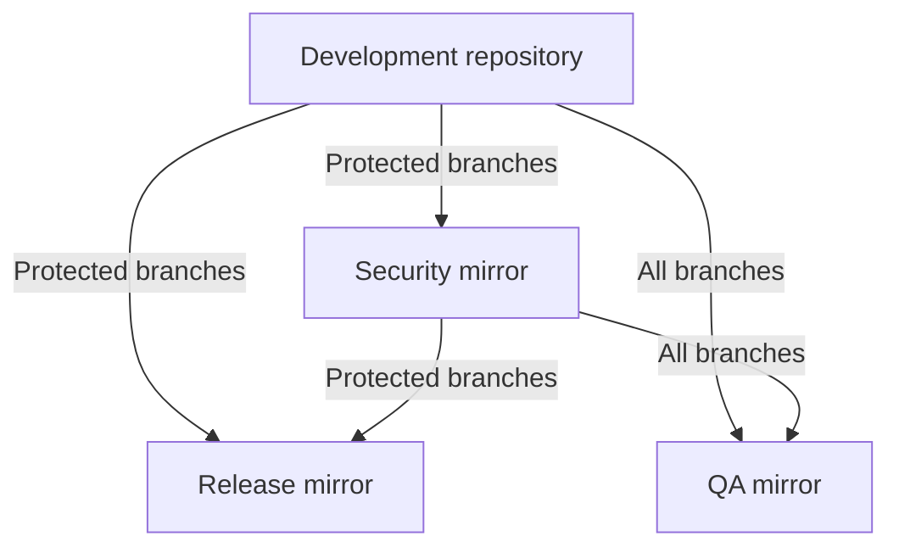

# Repositories, branches, and CI pipelines

`omnibus-gitlab` CI pipeline is a moderately complex one with pipelines split
between all the mirrors of the project:

1. [Development repository](https://gitlab.com/gitlab-org/omnibus-gitlab) for normal feature development.
1. [Release mirror](https://dev.gitlab.org/gitlab/omnibus-gitlab) for building release artifacts.
1. [Security mirror](https://gitlab.com/gitlab-org/security/omnibus-gitlab) for security development.
1. [QA mirror](https://gitlab.com/gitlab-org/build/omnibus-gitlab-mirror) for developers to run a package build and QA for development
   purposes.

## Branch and tag protection

### Protected branches

NOTE: **Note:**
Unless specified otherwise, the listed users/groups have permission to both merge, and push to
protected branches.

1. Development repository
    1. `master`: Maintainers, [Delivery team](https://gitlab.com/gitlab-org/delivery)
    1. `*-stable` : [Delivery team](https://gitlab.com/gitlab-org/delivery), [Release Managers](https://gitlab.com/gitlab-org/release/managers)
    1. `*-stable-ee` : [Delivery team](https://gitlab.com/gitlab-org/delivery), [Release Managers](https://gitlab.com/gitlab-org/release/managers)
    1. `*-auto-deploy-*` : Maintainers, [`delivery` group](https://gitlab.com/gitlab-org/delivery), [`managers` group](https://gitlab.com/gitlab-org/release/managers)

1. Release mirror:
    1. `master`: Maintainers
    1. `*-stable` : Maintainers
    1. `*-stable-ee` : Maintainers
    1. `*-auto-deploy-*` : Maintainers

1. Security mirror:
    1. `master`: [GitLab Release Tools Bot](https://gitlab.com/gitlab-release-tools-bot), [GitLab Bot](https://gitlab.com/gitlab-bot), [Delivery team](https://gitlab.com/gitlab-org/delivery), [Release Managers](https://gitlab.com/gitlab-org/release/managers)
    1. `*-stable`: [GitLab Release Tools Bot](https://gitlab.com/gitlab-release-tools-bot), [GitLab Bot](https://gitlab.com/gitlab-bot), [Delivery team](https://gitlab.com/gitlab-org/delivery), [Release Managers](https://gitlab.com/gitlab-org/release/managers)
    1. `*-stable-ee`: [GitLab Release Tools Bot](https://gitlab.com/gitlab-release-tools-bot), [GitLab Bot](https://gitlab.com/gitlab-bot), [Delivery team](https://gitlab.com/gitlab-org/delivery), [Release Managers](https://gitlab.com/gitlab-org/release/managers)
    1. `*-auto-deploy-*`: [GitLab Release Tools Bot](https://gitlab.com/gitlab-release-tools-bot), [GitLab Bot](https://gitlab.com/gitlab-bot), [Delivery team](https://gitlab.com/gitlab-org/delivery), [Release Managers](https://gitlab.com/gitlab-org/release/managers)

1. QA mirror:
    1. `master`: Developers (Merge only), Maintainers

NOTE: **Note:**
Developers get access to `master` branch in QA mirror because
that's required to run a triggered pipeline against the branch. There is an
[open issue](https://gitlab.com/gitlab-org/gitlab/-/issues/24585) to change this
situation.

### Protected Tags

NOTE: **Note:**
Unless specified otherwise, the listed users/groups have permission to both merge, and push to
protected tags.

1. Development repository:
    1. `*` : Maintainers, [Delivery team](https://gitlab.com/gitlab-org/delivery), [Release Managers](https://gitlab.com/gitlab-org/release/managers)

1. Release mirror:
    1. `*`: Maintainers

1. Security mirror: Nil

1. QA mirror: Nil

## Mirroring between repositories

Most of the development happens in the [Development repository](https://gitlab.com/gitlab-org/omnibus-gitlab)
and security related changes go to [Security mirror](https://gitlab.com/gitlab-org/security/omnibus-gitlab).
These changes then gets mirrored to [Release mirror](https://dev.gitlab.org/gitlab/omnibus-gitlab)
and [QA mirror](https://gitlab.com/gitlab-org/build/omnibus-gitlab-mirror). The
following diagram describes what all gets mirrored between each of these
repositories.

## Types of pipelines

### Branch pipelines

`omnibus-gitlab` doesn't make use of detached merge request pipelines yet. So,
pipelines caused by branch pushes are the common pipelines encountered in this
project. These pipelines are used in [Development repository](https://gitlab.com/gitlab-org/omnibus-gitlab), [Security mirror](https://gitlab.com/gitlab-org/security/omnibus-gitlab),
and [Release mirror](https://dev.gitlab.org/gitlab/omnibus-gitlab).

### Tag pipelines

Tag pushes to [Release mirror](https://dev.gitlab.org/gitlab/omnibus-gitlab) starts a pipeline with the
[release jobs](#release-jobs). Tag pushes to [Development repository](https://gitlab.com/gitlab-org/omnibus-gitlab) and [Security
mirror](https://gitlab.com/gitlab-org/security/omnibus-gitlab) behaves as regular branch pushes (except that they don't have an option
to start a package-and-qa pipeline) and run basic stylistic checks and unit
tests.

### Scheduled pipelines

In [Development repository](https://gitlab.com/gitlab-org/omnibus-gitlab), there are two scheduled pipelines.

1. `Dependencies Update` - Pipeline to check for outdated dependencies using the
   [`dependency_update`](#dependency_update) job.
1. `Generate license pages` - Pipeline to populate [License collection webpage](http://gitlab-org.gitlab.io/omnibus-gitlab/licenses.html)
   with license information from the S3 bucket.

In [Release mirror](https://dev.gitlab.org/gitlab/omnibus-gitlab), there are two scheduled pipelines

1. `CE nightly` - Pipeline to build nightly packages and Docker images for
   GitLab CE
1. `EE nightly` - Pipeline to build nightly packages and Docker images for
   GitLab EE

Other mirrors doesn't have any scheduled pipelines

### Auto-deploy pipelines

GitLab uses [Auto deploy](https://gitlab.com/gitlab-org/release/docs/blob/master/general/deploy/auto-deploy.md) branches and tags for its release process. These
branches are named `<MAJOR>-<MINOR>-auto-deploy-<TIMESTAMP>` and tags have the
format `<MAJOR>.<MINOR>.<TIMESTAMP>+<gitlab sha>.<omnibus-gitlab sha>`.

Only certain jobs - that are needed to deploy the changes to GitLab
environments - will be part of this pipeline.

### Triggered pipelines

We use triggered pipelines to run a "package-and-qa" pipeline in the [QA
mirror](https://gitlab.com/gitlab-org/build/omnibus-gitlab-mirror). These can be triggered either from a pipeline in the
[Development repository](https://gitlab.com/gitlab-org/omnibus-gitlab) or [GitLab project](https://gitlab.com/gitlab-org/gitlab).

This pipeline is intended to give the developers a package and an image to test
their changes in addition to automatically doing a QA run against these
artifacts. It also provides an option to do a QA run against an HA instance spun
up using these artifacts, and to run a memory measurement job to measure the
resource usage by GitLab using the Docker image.

## CI Jobs

### Development Jobs

#### `danger-review`

This job runs a check against the merge request to ensure it satisfies some
basic requirements using the Danger tool.

This job is run only on [Development repository](https://gitlab.com/gitlab-org/omnibus-gitlab) and [Security mirror](https://gitlab.com/gitlab-org/security/omnibus-gitlab) on branch
and tag pipelines.

#### `rubocop`

Check the source code files to satisfy certain stylistic requirements.

This job is run only on [Development repository](https://gitlab.com/gitlab-org/omnibus-gitlab) and [Security mirror](https://gitlab.com/gitlab-org/security/omnibus-gitlab) on branch
and tag pipelines.

#### `docs-lint`

Check the docs files to satisfy certain stylistic requirements.

This job is run only on [Development repository](https://gitlab.com/gitlab-org/omnibus-gitlab) and [Security mirror](https://gitlab.com/gitlab-org/security/omnibus-gitlab) on branch
and tag pipelines.

#### `review-docs-deploy`

A manual job that will trigger a docs build in `gitlab-docs`, which will deploy a
review app for the GitLab Docs with changes from the current commit.

This job is run only on [Development repository](https://gitlab.com/gitlab-org/omnibus-gitlab) on branch pipelines.

#### `review-docs-cleanup`

A manual job to stop the environment created by `review-docs-deploy`.
Automatically ran on merging a merge request.

This job is run only on [Development repository](https://gitlab.com/gitlab-org/omnibus-gitlab) on branch pipelines.

#### `<OS_NAME> knapsack`

We have tests covering our Chef recipes and libraries using `RSpec` and
`Chefspec`. They are parallelized with the help of
[knapsack](https://github.com/ArturT/knapsack).

This job pulls in the knapsack reports of previous pipeline runs from the cache
and gets them in place for the current spec runs.

These jobs are run only on [Development repository](https://gitlab.com/gitlab-org/omnibus-gitlab) and [Security mirror](https://gitlab.com/gitlab-org/security/omnibus-gitlab) on branch
and tag pipelines.

#### `<OS_NAME> specs`

Jobs that actually run `rspec` via `knapsack`. Parallelized to a count of 6
using the [`parralel` keyword](https://docs.gitlab.com/ee/ci/yaml/#parallel)

These jobs are run only on [Development repository](https://gitlab.com/gitlab-org/omnibus-gitlab) and [Security mirror](https://gitlab.com/gitlab-org/security/omnibus-gitlab) on branch
and tag pipelines.

#### `update-knapsack`

This job combines the reports from each individual parallel runs of unit tests
and prepares a final JSON report. This report is used by the MR widget to
display spec status, and is also uploaded to the cache for the next pipeline run
to use.

This job is run only on [Development repository](https://gitlab.com/gitlab-org/omnibus-gitlab) and [Security mirror](https://gitlab.com/gitlab-org/security/omnibus-gitlab) on branch and
tag pipelines.

#### `Trigger:ce-package`

This is a manual job which when played triggers a pipeline in the [QA mirror](https://gitlab.com/gitlab-org/build/omnibus-gitlab-mirror) to
run a package build and QA for development purposes. This can be used by
developers to get a package or Docker image for testing, or to run a full QA
suite against their MR's changes.

This job is run only on [Development repository](https://gitlab.com/gitlab-org/omnibus-gitlab) and [Security mirror](https://gitlab.com/gitlab-org/security/omnibus-gitlab) on branch
pipelines.

#### `Trigger:ee-package`

Same as `Trigger:ce-package`, but builds an EE package.

This job is run only on [Development repository](https://gitlab.com/gitlab-org/omnibus-gitlab) and [Security mirror](https://gitlab.com/gitlab-org/security/omnibus-gitlab) on branch
pipelines.

#### `fetch-assets`

For building packages, we make use of the Rails assets that are already compiled
by the [GitLab](https://gitlab.com/gitlab-org/gitlab) or
[GitLab-FOSS](https://gitlab.com/gitlab-org/gitlab-foss) pipelines. Those
pipelines push it as a Docker image, which we pull in here and copy the assets
themselves to a predefined location.

This job is run only on [Release mirror](https://dev.gitlab.org/gitlab/omnibus-gitlab) and [QA mirror](https://gitlab.com/gitlab-org/build/omnibus-gitlab-mirror) on branch, tag and
triggered pipelines.

#### `Trigger:package`

This job builds a single package that will be available as an artifact.

This job is run only on [QA mirror](https://gitlab.com/gitlab-org/build/omnibus-gitlab-mirror) on triggered pipelines.

#### `Trigger:gitlab-docker`

This job builds a GitLab Docker image using the package that was built by
`Trigger:package` job.

This job is run only on [QA mirror](https://gitlab.com/gitlab-org/build/omnibus-gitlab-mirror) on triggered pipelines.

#### `Trigger:qa-docker`

This job builds a GitLab QA Docker image from the [qa directory in the Rails
codebase](https://gitlab.com/gitlab-org/gitlab/blob/master/qa/Dockerfile). This
QA image is used for QA runs.

This job is run only on [QA mirror](https://gitlab.com/gitlab-org/build/omnibus-gitlab-mirror) on triggered pipelines.

#### `Trigger:qa-test`

This job triggers a pipeline in the [GitLab QA Mirror](https://gitlab.com/gitlab-org/gitlab-qa-mirror), passing the GitLab
Docker image created by `Trigger:gitlab-docker` job and the GitLab QA Docker
image built by the `Trigger:qa-docker` job, so that a full QA run will be run
against up using these images

This job is run only on [QA mirror](https://gitlab.com/gitlab-org/build/omnibus-gitlab-mirror) on triggered pipelines.

#### `Trigger:ha-validate`

This manual job triggers a pipeline in the [GitLab Provisioner](https://gitlab.com/gitlab-org/distribution/gitlab-provisioner) project passing
the URL to the package built by `Trigger:package` job, which will spin up an HA
instance in Terraform using that package and run QA against it.

This job is run only on [QA mirror](https://gitlab.com/gitlab-org/build/omnibus-gitlab-mirror) on triggered pipelines.

#### `Trigger:measure-memory`

This manual job spins up a Docker container using the GitLab Docker image and
measures memory usage inside it and stores the details as an artifact.

This job is run only on [QA mirror](https://gitlab.com/gitlab-org/build/omnibus-gitlab-mirror) on triggered pipelines.

#### `<OS_NAME>-branch`

These jobs build packages for the specified OS, and pushes the resultant package
to an S3 bucket in addition to making them available as artifacts.

This job is run only on [Release mirror](https://dev.gitlab.org/gitlab/omnibus-gitlab) on branch and nightly pipelines.

`NOTE`: Raspberry Pi jobs are run only on CE branches while SLES jobs are run
only on EE branches.

#### `Docker-branch`

This job builds a GitLab Docker image using the package built during the Ubuntu
16.04-branch job. The image is pushed to the GitLab container registry.

This job is run only on [Release mirror](https://dev.gitlab.org/gitlab/omnibus-gitlab) on branch and nightly pipelines.

#### `QA-branch`

This job builds a GitLab QA Docker image from the [qa directory in the Rails
codebase](https://gitlab.com/gitlab-org/gitlab/blob/master/qa/Dockerfile).

This job is run only on [Release mirror](https://dev.gitlab.org/gitlab/omnibus-gitlab) on branch and nightly pipelines.

#### `Docker-branch-measure-memory`

This manual job spins up a Docker container using the GitLab Docker image and
measures memory usage inside it and stores the details as an artifact.

This job is run only on [Release mirror](https://dev.gitlab.org/gitlab/omnibus-gitlab) on branch and nightly pipelines.

## Release jobs

### `<OS_NAME>`

These jobs build packages for the specified OS, and pushes the resultant package
to an S3 bucket in addition to making them available as artifacts.

This job is run only on [Release mirror](https://dev.gitlab.org/gitlab/omnibus-gitlab) on tag pipelines.

NOTE: **Note:**
Raspberry Pi jobs are run only on CE tags while SLES jobs are run only on EE tags.

### `<OS_NAME>-staging`

These jobs upload the packages built in previous job to an internal staging
repository in [Packagecloud instance](https://packages.gitlab.com).

This job is run only on [Release mirror](https://dev.gitlab.org/gitlab/omnibus-gitlab) on tag pipelines.

NOTE: **Note:**
Raspberry Pi jobs are run only on CE tags while SLES jobs are run only on EE tags.

### `<OS_NAME>-release`

These jobs pulls the packages from the internal staging repository to a public
repository in [Packagecloud instance](https://packages.gitlab.com).

This job is run only on [Release mirror](https://dev.gitlab.org/gitlab/omnibus-gitlab) on tag pipelines.

NOTE: **Note:**
Raspberry Pi jobs are run only on CE tags while SLES jobs are run only on EE tags.

### `Docker`

This job builds a GitLab Docker image using the package built during the Ubuntu
16.04-branch job. The image is pushed to the internal GitLab container registry.

This job is run only on [Release mirror](https://dev.gitlab.org/gitlab/omnibus-gitlab) on tag pipelines.

### `Docker-Release`

This job pulls the GitLab Docker image from internal GitLab container registry
and pushes it to Dockerhub.

This job is run only on [Release mirror](https://dev.gitlab.org/gitlab/omnibus-gitlab) on tag pipelines.

### `Docker-QA`

This job builds a GitLab QA Docker image from the [qa directory in the Rails
codebase](https://gitlab.com/gitlab-org/gitlab/blob/master/qa/Dockerfile) and
pushes it to the internal GitLab container registry.

This job is run only on [Release mirror](https://dev.gitlab.org/gitlab/omnibus-gitlab) and on tag pipelines.

### `QA-Tag`

This job pulls the GitLab QA Docker image from the internal GitLab container
registry and pushes it to Dockerhub.

This job is run only on [Release mirror](https://dev.gitlab.org/gitlab/omnibus-gitlab) and on tag pipelines.

### `AWS`

This job builds the unlicensed AWS AMIs using the Ubuntu 16.04 package.

This job is run only on [Release mirror](https://dev.gitlab.org/gitlab/omnibus-gitlab) and on tag pipelines.

### `AWS-Ultimate`

This job builds an AWS AMI with embedded Ultimate licenses using the Ubuntu
16.04 package.

This job is run only on [Release mirror](https://dev.gitlab.org/gitlab/omnibus-gitlab) and on EE tag pipelines.

### `AWS-Premium`

This job builds an AWS AMI with embedded Premium licenses using the Ubuntu
16.04 package.

This job is run only on [Release mirror](https://dev.gitlab.org/gitlab/omnibus-gitlab) and on EE tag pipelines.

### `AWS-CE-Release`

This job updates the [GitLab Community Edition listing in AWS Marketplace](https://aws.amazon.com/marketplace/pp/B071RFCJZK?ref_=srh_res_product_title) with the current version.

This job is run only on [Release mirror](https://dev.gitlab.org/gitlab/omnibus-gitlab) and on CE tag pipelines.

### `AWS-Ultimate-Release`

This job updates the [GitLab Ultimate listing in AWS Marketplace](https://aws.amazon.com/marketplace/pp/B07SJ817DX?ref_=srh_res_product_title) with the current version.

This job is run only on [Release mirror](https://dev.gitlab.org/gitlab/omnibus-gitlab) and on EE tag pipelines.

### `AWS-Premium-Release`

This job updates the [GitLab Premium listing in AWS Marketplace](https://aws.amazon.com/marketplace/pp/B085Y7TJ5K?ref_=srh_res_product_title) with the current version.

This job is run only on [Release mirror](https://dev.gitlab.org/gitlab/omnibus-gitlab) and on EE tag pipelines.

### `create_omnibus_manifest`

This job creates a `version-manifest.json` file to be used by
`dependency_scanning` job.

This job is run only on [Release mirror](https://dev.gitlab.org/gitlab/omnibus-gitlab) and on tag and nightly pipelines.

### `dependency_scanning`

This job runs a dependency scan on all the components of the package to check if
any of them are vulnerable to any known vulnerabilities.

This job is run only on [Release mirror](https://dev.gitlab.org/gitlab/omnibus-gitlab) and on tag and nightly pipelines.

### `HA-Validate-Tagged`

This job triggers a pipeline in the [GitLab Provisioner](https://gitlab.com/gitlab-org/distribution/gitlab-provisioner) project passing the URL
to the Ubuntu 16.04 package built in this pipeline, which will spin up an HA
instance in Terraform using that package and run QA against it.

This job is run only on [Release mirror](https://dev.gitlab.org/gitlab/omnibus-gitlab) on tag pipelines.

### `Docker-measure-memory`

This job spins up a Docker container using the GitLab Docker image and measures
memory usage inside it and stores the details as an artifact.

This job is run only on [Release mirror](https://dev.gitlab.org/gitlab/omnibus-gitlab) on tag pipelines.

### `license-upload`

This job compiles the license information of all the dependencies from the
package and uploads it to the S3 bucket. This is used by
[`pages`](#pages) scheduled job in [Development repository](https://gitlab.com/gitlab-org/omnibus-gitlab) to populate the
[License collection webpage](http://gitlab-org.gitlab.io/omnibus-gitlab/licenses.html).

## Housekeeping Jobs

### `dependency_update`

This job makes use of Dependencies.io to automatically check for version updates
of various components that we include in our package and open merge request
against [Development repository](https://gitlab.com/gitlab-org/omnibus-gitlab) if an update is found.

This job is run only on [Development repository](https://gitlab.com/gitlab-org/omnibus-gitlab), on scheduled pipelines when
`DEPS_PIPELINE` variable exists.

### `dependencies_io_check`

This job automatically triggers a package-and-qa pipeline in [QA mirror](https://gitlab.com/gitlab-org/build/omnibus-gitlab-mirror),
(similar to `Trigger:ce-package` job), when a merge request is made by
`dependency_update` job.

This job is run only on [Development repository](https://gitlab.com/gitlab-org/omnibus-gitlab) when the branch name starts with
`deps` (this is the format that `dependency_update` job uses for merge requests)

### `valdiate_packer_changes`

This job checks if the [packer configuration files](https://dev.gitlab.org/gitlab/omnibus-gitlab/-/tree/master/support/packer) are valid or not.

This job is run only on [Development repository](https://gitlab.com/gitlab-org/omnibus-gitlab) and [Security mirror](https://gitlab.com/gitlab-org/security/omnibus-gitlab), when any of
the [packer configuration files](https://dev.gitlab.org/gitlab/omnibus-gitlab/-/tree/master/support/packer) are modified.

### `pages`

This job is associated with GitLab Pages, and generates a static website
containing license information of various components included in the package for
each release of GitLab.

This job is run only on [Development repository](https://gitlab.com/gitlab-org/omnibus-gitlab) and on scheduled pipelines which
does not have the `DEPS_PIPELINE` variable (to differentiate it from
`dependency_update` runs).
