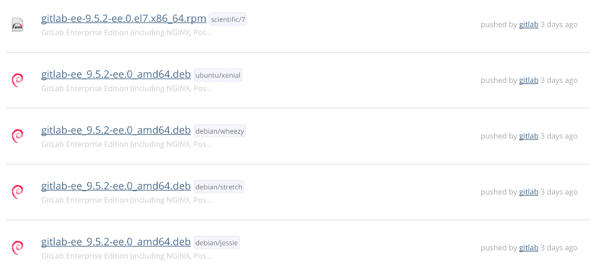

# Manually Downloading and Installing a GitLab Package

## The package repository is recommended over a manual install

We recommend downloading and installing GitLab using the official [package repository](https://about.gitlab.com/install/). If you prefer, you can download and install an Omnibus GitLab package manually below.

## Requirements

Before installing GitLab, it is of critical importance to review the system [requirements](https://docs.gitlab.com/ee/install/requirements.html). The system requirements include details on the minimum hardware, software, database, and additional requirements to support GitLab.

## Downloading a GitLab Package

All GitLab packages are posted to our [package server](https://packages.gitlab.com/gitlab/) and can be downloaded. We maintain five repos:

- [GitLab EE](https://packages.gitlab.com/gitlab/gitlab-ee): for official Enterprise Edition releases
- [GitLab CE](https://packages.gitlab.com/gitlab/gitlab-ce): for official Community Edition releases
- [Unstable](https://packages.gitlab.com/gitlab/unstable): for release candidates and other unstable versions
- [Nighty Builds](https://packages.gitlab.com/gitlab/nightly-builds): for nightly builds
- [Raspberry Pi 2](https://packages.gitlab.com/gitlab/raspberry-pi2): for [Raspberry Pi 2](https://www.raspberrypi.org) packages

Browse to the repository for the type of package you would like, in order to see the list of packages that are available. There are multiple packages for a single version, one for each supported distribution type. Next to the filename is a label indicating the distribution, as the file names may be the same.

Locate the desired package for the version and distribution you want to use, and click on the filename to download.

## Installing the GitLab Package

With the desired package downloaded, use your systems package management tool to install it. For example:

- DEB based (Ubuntu, Debian, Raspberry Pi): `sudo EXTERNAL_URL="http://gitlab.example.com" dpkg -i gitlab-ee-9.5.2-ee.0_amd64.deb`
- RPM based (CentOS, RHEL, Oracle, Scientific, openSUSE, SLES): `sudo EXTERNAL_URL="http://gitlab.example.com" rpm -i gitlab-ee-9.5.2-ee.0.el7.x86_64.rpm`

Change `http://gitlab.example.com` to the URL at which you want to access your GitLab instance. Installation will automatically configure and start GitLab at that URL.

> **Note:** Enabling HTTPS will require [additional configuration](settings/nginx.html#enable-https) to specify the certificates.

## Browse to the hostname and login

On your first visit, you'll be redirected to a password reset screen. Provide the password for the initial administrator account and you will be redirected back to the login screen. Use the default account's username `root` to login.

See our [documentation for detailed instructions on installing and configuration](https://docs.gitlab.com/omnibus/README.html#installation-and-configuration-using-omnibus-package).
